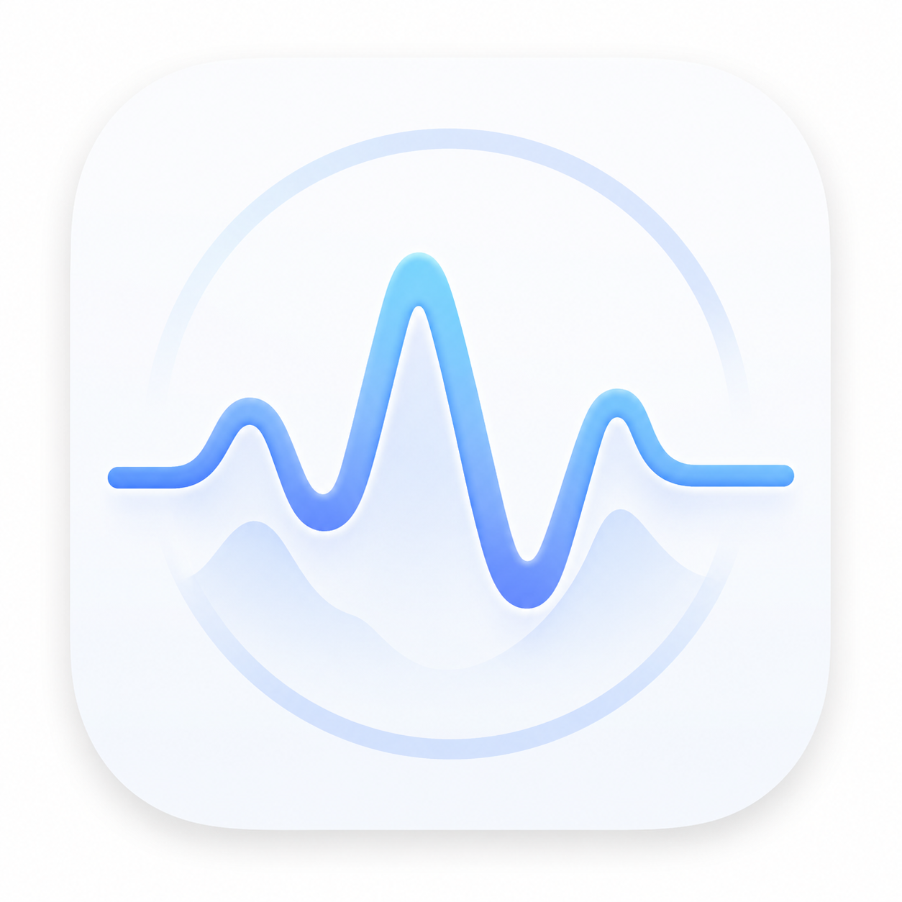
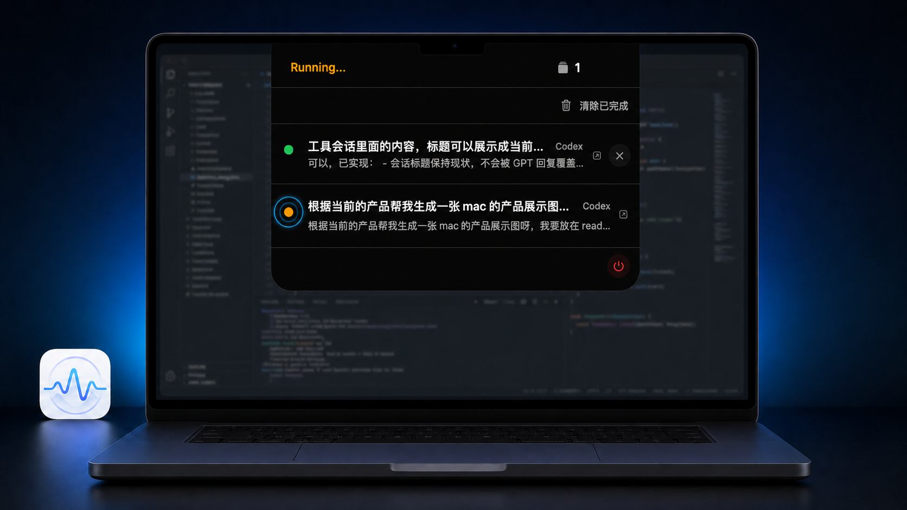

# AgentPulse

<p align="center">
  
</p>

<p align="center">
  <strong>一眼掌握所有本地 AI Agent 会话状态。</strong>
</p>

<p align="center">
  一个面向 macOS 与 Windows 的轻量级本地状态面板，集中展示 Codex、Claude Code 及自定义 Agent 的运行进度与待处理操作。
</p>

<p align="center">
  <a href="https://github.com/xiaoaozz/AgentPulse/actions/workflows/ci.yml"></a>
  <a href="https://github.com/xiaoaozz/AgentPulse/releases"></a>
  
  
</p>

---

## 产品展示

### macOS

<p align="center">
  
</p>

### Windows

> 🪟 **Windows 产品展示图待补充**
>
> 建议展示系统托盘入口与 WinUI 3 会话面板，成图保存为 `docs/assets/agentpulse-windows-showcase.png`。

<!-- Windows 成图完成后，用下面的内容替换上方占位提示：
<p align="center">
  
</p>
-->

## 为什么需要 AgentPulse？

同时运行多个 AI Agent 时，你通常需要在不同终端、编辑器和项目之间来回切换，才能确认任务是否仍在执行、已经完成，或正等待权限审批。

AgentPulse 将这些状态集中到一个始终可见的原生面板中：

- **正在做什么**：统一查看多个 Agent 会话的当前阶段与最新摘要。
- **哪里需要你**：优先突出 `waiting_for_action` 会话，减少等待和遗漏。
- **快速回到现场**：点击会话即可激活对应终端或来源应用。
- **数据留在本机**：事件只通过 Unix Domain Socket 或 Named Pipe 传输，不开放 TCP 端口，也不上传会话内容。

AgentPulse 只负责状态聚合与入口跳转，不会代替 Agent 审批权限，也不会读取完整对话记录。

## 核心特性

- **macOS 原生刘海面板**：自动识别内置刘海屏幕，在刘海两侧展示状态与进行中会话数；悬停后展开最近会话。
- **Windows 原生托盘面板**：常驻系统托盘，在任务栏右下角快速展开 WinUI 3 会话列表。
- **多 Agent、多会话聚合**：支持 Codex、Claude Code 和遵循通用事件协议的自定义 Agent。
- **清晰的状态优先级**：等待操作、运行中、暂停、完成、警告和失败等状态自动排序。
- **快速返回来源应用**：根据进程信息激活 Terminal、iTerm2、Ghostty、Warp、VS Code、Windows Terminal 或 PowerShell 等应用。
- **低侵入 Hook 接入**：内置 Node.js 与 Python 适配器；AgentPulse 未运行时静默退出，不阻断 Agent 工作。
- **清晰的发布产物**：每个平台只提供可直接安装或运行的使用包。
- **原生、轻量、无 Electron**：macOS 使用 SwiftUI/AppKit，Windows 使用 WinUI 3 与 .NET 8。

## 支持平台

| 平台 | 系统要求 | 交互形态 | 本地事件通道 |
| --- | --- | --- | --- |
| macOS | macOS 14+，Apple Silicon / Intel | 刘海常驻面板 | Unix Domain Socket |
| Windows | Windows 10 1809+ / Windows 11，x64 | 系统托盘面板 | Named Pipe |

## 安装

前往 [GitHub Releases](https://github.com/xiaoaozz/AgentPulse/releases) 下载最新版本。

### macOS

下载 `AgentPulse-*-macos-universal.zip`，解压后将 `AgentPulse.app` 拖入 `/Applications`。

正式签名并经过 Apple 公证的版本可直接打开；文件名带 `-unsigned` 的测试版本首次启动时，需要在 Finder 中右键应用并选择“打开”。

### Windows

推荐下载 `AgentPulse-Windows-Setup.exe`；不想安装时可下载 `AgentPulse-Windows-Portable.zip`。新版本请从 Releases 手动下载安装。

## 快速接入

AgentPulse 通过 Hook 接收 Agent 生命周期事件。Release 安装包已经包含接入脚本。

### Codex

在 Codex 生命周期 Hook 中调用：

```bash
node /Applications/AgentPulse.app/Contents/Resources/Scripts/agent-pulse-codex-hook.mjs
```

Windows 请将路径替换为 AgentPulse 安装目录下的 `Scripts/agent-pulse-codex-hook.mjs`。推荐监听 `SessionStart`、`UserPromptSubmit`、`PreToolUse`、`PostToolUse`、`PermissionRequest` 和 `Stop`，以获得完整状态变化。工具事件会从本轮 transcript 提取最新 GPT 阶段回复并更新会话详情，标题保持不变。

### Claude Code 或其他 Agent

在对应生命周期 Hook 中调用：

```bash
python3 /Applications/AgentPulse.app/Contents/Resources/Scripts/agentpulse-hook.py
```

也可以直接向本地端点发送符合协议的 JSON，将任何自研 Agent 接入 AgentPulse。

完整 Hook 配置、事件映射、审批者模式及通用 JSON 协议请参阅 [技术指南](docs/technical-guide.md)。

## 工作原理

```text
Codex / Claude Code / Custom Agent
                │
          Lifecycle Hooks
                │
       Node.js / Python Adapter
                │
    ┌───────────┴───────────┐
    │                       │
macOS Unix Socket    Windows Named Pipe
    │                       │
    └───────────┬───────────┘
                │
       Session Repository
                │
      Notch / Tray UI Panel
```

同一 `session_id` 的事件会更新同一条会话记录。所有状态仅保存在内存中，应用退出后不会保留历史会话。

## 从源码运行

### macOS

需要支持 Swift 6.1 Package Manifest 的 Swift 工具链：

```bash
swift run AgentPulse
```

### Windows

需要 .NET 8 SDK：

```powershell
dotnet build Windows/AgentPulse.Windows/AgentPulse.Windows.csproj -c Release -p:Platform=x64
```

运行测试：

```bash
swift test
node --test Tests/HookTests/agent-pulse-codex-hook.test.mjs
python3 -m unittest discover -s Tests/HookTests -p 'test_*.py'
```

## 文档

- [技术指南](docs/technical-guide.md)：完整安装说明、Hook 配置、事件协议、构建发布与故障排查
- [事件 JSON Schema](Protocol/agent-event.schema.json)：通用事件字段与约束
- [跨平台协议 Fixtures](Protocol/Fixtures/session-scenarios.json)：客户端共享行为示例

## 项目结构

```text
AgentPulse/
├── Sources/AgentPulse/          # macOS 应用与刘海面板
├── Sources/AgentPulseCore/      # Swift 事件模型、服务与会话仓库
├── Windows/                     # WinUI 3 客户端与 C# 核心
├── scripts/                     # Codex / Claude Hook 适配器
├── Protocol/                    # 跨平台事件协议
└── Tests/                       # Swift、Node.js 与 Python 测试
```

## 参与贡献

欢迎提交 [Issue](https://github.com/xiaoaozz/AgentPulse/issues) 报告问题或提出建议，也欢迎通过 Pull Request 改进客户端、适配器和协议实现。

提交改动前，请运行与改动范围相关的测试，并确保 macOS 与 Windows 对共享协议的行为保持一致。

## 隐私与设计边界

- Codex Hook 仅按需读取 transcript 尾部来提取本轮最新 GPT 回复，不保存或上传完整对话。
- 不上传事件或会话信息，所有通信均在本机完成。
- 不批准、拒绝或修改 Agent 的权限请求。
- 不保证定位到具体终端标签页或 Codex 任务，仅负责激活来源应用。
- 当前会话数据不持久化，重启 AgentPulse 后会清空。

---

如果 AgentPulse 对你有帮助，欢迎点一个 Star，让更多同时运行多个 Agent 的开发者找到它。
